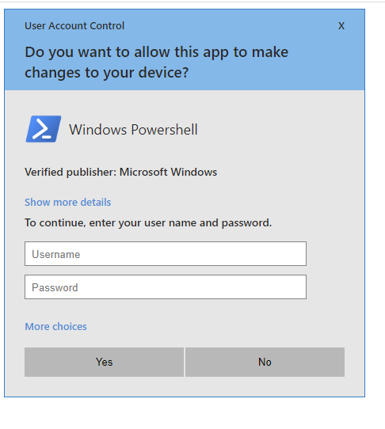

# OITB
___

OitB (OS in the Browser) is inspired by [BITB](https://github.com/mrd0x/BITB) I wanted to add native OS windows... like the one that asks for a password
for keychain access. This was mostly done to see how close I could mock up a window to the native MacOSX window.

## MacOS-KeychainAccess

The top element is the one generated in pure HTML/CSS and the bottom is the native window.
There are some subtle differences and some big obvious giveaways, like the Keepass icon on the password field.
I may just remove the `type=password` and tap into the keyboard events to proxy the password to some field, but for now
I'm satisfied with it, I did add the `data-lpignore` attribute to that LassPass doesn't put their icon on the field, if someone
knows of a similar attribute for Keepass let me know.

You'll really just want to replace the variable
- **XX-C2API-XX** - Url to send password to via POST request

## Windows-UAC

Again, top image is the one generated in HTML/CSS and

This one is a screenshot of the native window.

Variables to modify:
- **XX-C2API-XX** - Url to send username/password to via POST request
- **XX-APPLICATION-NAME-XX** - Name of application to request as
- **XX-APPLICATION-ICON-XX** - Image of application to request as

